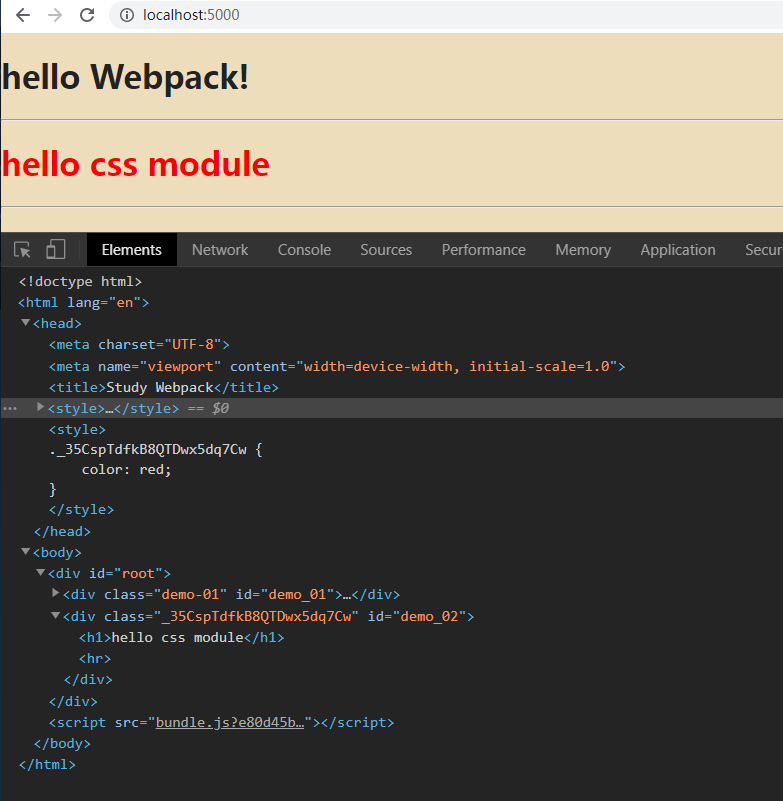

# Study Webpack

一步一步学习 webpack 。

## 准备

使用 yarn 初始化，生成项目信息

```shell
mkdir study-webpack
cd study-webpack
yarn init
```
## 安装 webpack 包

```shell
yarn add --dev webpack
yarn add --dev webpack-cli webpack-dev-server
```

## 1. 实现 html 打包

安装 webpack 插件

```shell
yarn add --dev html-webpack-plugin
```

新建 public 和 src 目录

```shell
mkdir public
mkdir src
```

编写 public/index.html 代码

```html
<!DOCTYPE html>
<html lang="en">
<head>
    <meta charset="UTF-8">
    <meta name="viewport" content="width=device-width, initial-scale=1.0">
    <title><%= htmlWebpackPlugin.options.title %></title>
</head>
<body>
    <div id="root"></div>
</body>
</html>
```

编写 第一个 组件

src/components/Greeter/index.js
```javascript
export default () => {
    let greet = document.createElement('div');
    greet.className = 'demo-01';
    greet.id = 'demo_01';
    greet.innerHTML = '<h1>hello Webpack!</h1><hr />';
    return greet;
}
```

编写入口文件

src/index.js
```javascript
import Greeter from './components/Greeter/index'

let root = document.querySelector('#root');
root.appendChild(Greeter())

```

编写 webpack 配置

webpack.config.js
```javascript
const path = require('path');
const htmlWebpackPlugin = require('html-webpack-plugin');

module.exports = {
    plugins: [
        new htmlWebpackPlugin({
            title: "Study Webpack", // 标题
            template: "./public/index.html", // 模版位置
        })
    ]
}
```

执行打包

```shell
yarn webpack
```

查看效果

```shell
yarn global add serve
serve ./dist
```

把控制台显示的地址(一般是 http://localhost:5000) 复制到浏览器打开查看显示效果


## 2. 配置用 babel 编译 JavaScript

大部分浏览器已经支持 ES5，更现代的浏览器也都支持 ES2015(ES6)。
当我们编写javascript时，可以用更先进的 ES2015 规范去写。
同时，为了让一些老的浏览器也能运行我们编写的页面，我们可以用 babel 把 ES2015 编译成 ES5 规范的代码。

babel 可以在命令行独立执行编译，同时，为了省时省心，我们可以用 babel-loader 让 webpack 也具备了调用 babel 编译 javascript 的能力。

安装 babel

```shell
yarn add --dev @babel/core @babel/preset-env babel-loader
```

@babel/core babel的核心。

@babel/preset-env 囊括了 ES2015 ES2016 ES2017 等标准的包，让 babel 能认读ES6+的代码，从而实现编译。

babel-loader 是 webpack 拥有了调用 babel 的能力。

修改 webpack 配置

webpack.config.js
```javascript
const path = require('path');
const htmlWebpackPlugin = require('html-webpack-plugin');

module.exports = {
    plugins: [
        new htmlWebpackPlugin({
            title: "webpack demo 01", // 标题
            template: "./public/index.html", // 模版位置
        })
    ],
    module: {
        rules: [
            {
                test: /(\.js)$/,
                exclude: /node_modules/,
                use: {
                    loader: 'babel-loader'
                }
            }
        ]
    }
}
```

编写 babel 配置

.babelrc
```json
{
    "presets": ["@babel/preset-env"]
}
```

## 2. 配置 webpack 能打包 css

安装 css 处理包

```shell
yarn add --dev css-loader style-loader
```

编写样式文件

src/index.css
```css
html {
    font-size: 15px;
}

body {
    font-size: 16px;
}

body {
    margin: 0;
    padding: 0;
    text-align: center;
    color: #222;
    background-color: #eeddbb;
}
```

修改入口文件，新增一行引入样式

src/index.js

```javascript
// 增加全局样式
import './index.css';

```

修改 webpack 配置

在 webpack.config.js 对应位置加入下面的配置

webpack.config.js
```javascript
module.exports = {
    module: {
        rules: [
            {
                test: /(\.css)$/,
                use: [
                    {
                        loader: 'style-loader'
                    },
                    {
                        loader: 'css-loader'
                    }
                ]
            }
        ]
    }
}
```

执行打包并查看效果

```shell
yarn webpack
serve ./dist
```

## 3. 配置 webpack 支持 css 模块化

修改 webpack.config.js 以支持 css modules

webpack.config.js
```javascript
module.exports = {
    module: {
        rules: [
            {
                test: /(\.css)$/,
                use: [
                    {
                        loader: 'style-loader'
                    },
                    {
                        loader: 'css-loader',
                         options: {
                            modules: true  // 启用 css-modules
                        }
                    }
                ]
            }
        ]
    }
}
```

新建三个文件

src/components/GreeterCss/msg.json
```json
{
    "greet": "hello css module"
}
```

src/components/GreeterCss/index.css
```css
.greet {
    color: red;
}
```

src/components/GreeterCss/index.js
```javascript
import msg from './msg.json'
import styles from './index.css'

export default () => {
    let greet = document.createElement('div');
    greet.className = styles.greet;
    greet.id = 'demo_02';
    greet.innerHTML = `<h1>${msg.greet}</h1><hr />`;
    return greet;
}
```

修改入口文件，新增两行代码

src/index.js
```javascript
import GreetCss from './components/GreeterCss/index';

root.appendChild(GreetCss());
```

执行打包

```shell
yarn webpack
```




## 4. 配置 webpack 支持 css 模块化


我们发现 index.css 里的样式全部内联到了 index.html 中。

那么接着调整 webpack 中的配置，使 css 文件拆分出来。


